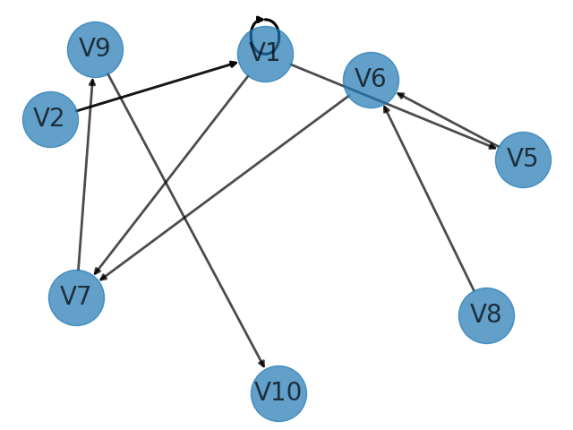

# Описание работы программы
Каждый шаг оптимизации рисуется на изображении.
Изображения сохраняются в папку сессии запуска программы, которая создается автоматически.

# Рисунок 17

**Представление графа для программы**:

`"1:5,4; 2:1,3; 3:1; 4:3,7; 5:6; 6:7; 7:9; 8:6; 9:10;"`

**Получившийся граф**: 



**Получившийся граф (множественное предсавление)**: 
```
V1 = {'V7', 'V1', 'V5'}
V2 = {'V1'}
V5 = {'V6'}
V6 = {'V7'}
V7 = {'V9'}
V8 = {'V6'}
V9 = {'V10'}
```

# Вариант 1

**Представление графа для программы**:

`"1:4; 2:6,7; 3:2,7; 4:8; 5:1,2,4,8,9; 6:7; 9:8,10,13; 10:13,6,11,9; 11:14,15,17; 12:8,9; 13:12,14; 14:15;"`

**Получившийся граф**: 


**Получившийся граф (множественное предсавление)**: 
```
V1 = {'V4'}
V2 = {'V7', 'V6'}
V3 = {'V7', 'V2'}
V4 = {'V8'}
V5 = {'V1', 'V9', 'V2', 'V8', 'V4'}
V6 = {'V7'}
V9 = {'V14', 'V9', 'V11', 'V6', 'V8'}
V11 = {'V14', 'V7', 'V15'}
V14 = {'V15'}
```